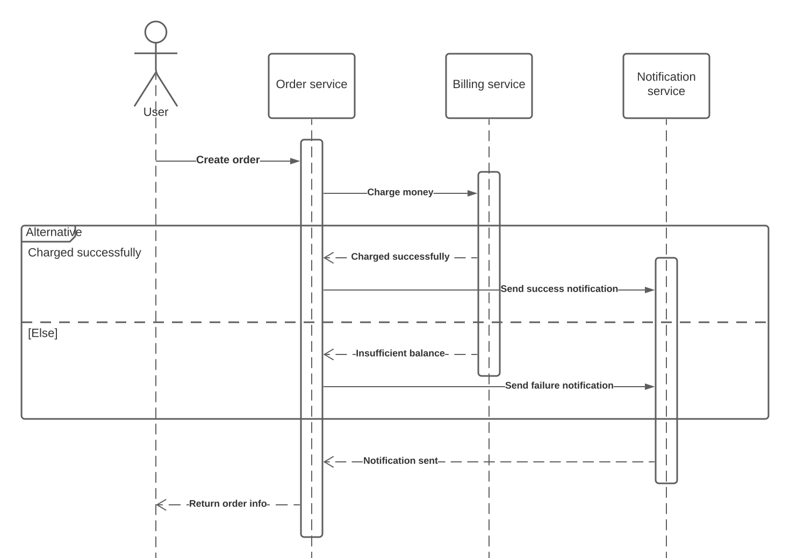

# HW Stream processing

## Communication between services could have been implemented 3 different ways

1. HTTP only:


2. HTTP for auth, user, billing, order services. Message broker for notification service;

3. Using event collaboration design.

### Clone the repo:
```bash
git clone https://github.com/alikhanmurzayev/otus_stream_processing.git && cd otus_stream_processing
```

### Start minikube
```bash
minikube start --cpus=4 --memory=4g --vm-driver=virtualbox
```

### Create namespaces:
```bash
kubectl apply -f k8s/namespaces.yaml
```

### Setup ambassador:
Obtain a new licence https://www.getambassador.io/aes-community-license-renewal/
```bash
helm install -n ambassador --set licenseKey.value=<enter licence key here> \
-f k8s/ambassador.yaml ambassador datawire/ambassador
```

### Setup RabbitMQ:
```bash
helm install -f k8s/rabbit.yaml my-rabbit bitnami/rabbitmq -n rabbit
```

### Start services:
```bash
kubectl apply -f k8s/config.yaml -f k8s/postgres.yaml -n postgres
kubectl apply -f k8s/config.yaml -f k8s/auth-app.yaml -n auth
kubectl apply -f k8s/config.yaml -f k8s/user-app.yaml -n user
kubectl apply -f k8s/config.yaml -f k8s/billing-app.yaml -n billing
kubectl apply -f k8s/config.yaml -f k8s/order-app.yaml -n order
kubectl apply -f k8s/config.yaml -f k8s/notification-app.yaml -n notification
```

### Wait for ambassador to up
```bash
for (( ; ; )); do [[ $(kubectl get po -n ambassador | grep "1/1" | wc -l) == 2 ]] \
    && echo "ambassador is up" && break || echo "ambassador is down" && sleep 1; done
```

### Setup routes and auth rules
```bash
kubectl apply -f k8s/ambassador-routes.yaml -f k8s/ambassador-auth.yaml
```

### Wait for services to up
```bash
BASE_URL=$(minikube service list|grep 'ambassador'|grep 'http'|grep -Eo 'http://[^ >]+'|head -1) \
    && until curl --fail $BASE_URL/auth/health; do sleep 1; done \
    && until curl --fail $BASE_URL/user/health; do sleep 1; done \
    && until curl --fail $BASE_URL/billing/health; do sleep 1; done \
    && until curl --fail $BASE_URL/order/health; do sleep 1; done \
    && until curl --fail $BASE_URL/notification/health; do sleep 1; done; echo; echo "services are up"
```

### Run test:
```bash
BASE_URL=$(minikube service list|grep 'ambassador'|grep 'http'|grep -Eo 'http://[^ >]+'|head -1) \
    newman run --verbose --global-var "baseUrl=$BASE_URL" collection.json
```
